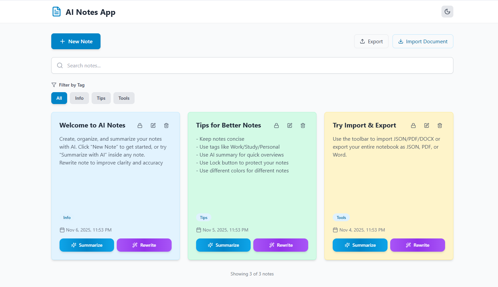
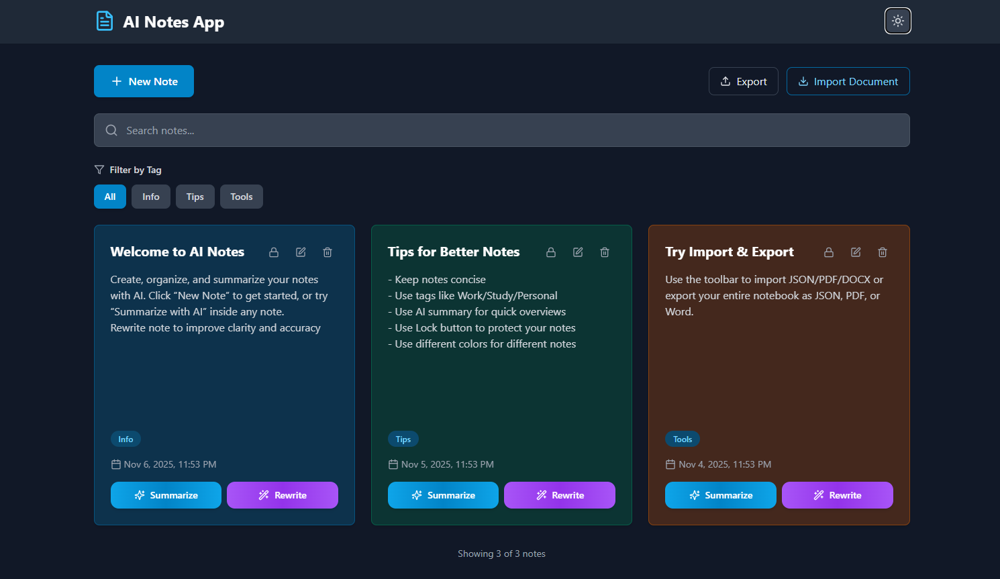

# 📝 AI Notes App

A **modern, AI-powered note-taking** application built with **React, Tailwind CSS, and Framer Motion**.  
Create, organize, lock, and enhance your notes with intelligent features like **AI summarization** and **AI rewriting** — all while keeping your data stored securely on your device.

> ✨ *Fast. Minimal. Smart. Private.*

---

## ✨ Key Features

| Feature | Description |
|--------|-------------|
| 🤖 **AI Summarization** | Get short and clear summaries of long notes using OpenAI AI models. |
| ✍️ **AI Rewriting** | Automatically rewrite, improve, or reword your text with one click. |
| 🔒 **PIN Lock** | Lock individual notes or the entire app with a PIN. |
| 🎨 **Color-Coded Notes** | Choose custom colors to visually organize your notes. |
| 🏷️ **Tag System** | Add tags and filter notes by categories. |
| 🔍 **Smart Search** | Search notes by title and content instantly. |
| 🌓 **Dark / Light Mode** | Seamless theme switching that matches your system settings. |
| 📥 **Import Notes** | Import from **PDF, DOCX, JSON** files. |
| 📤 **Export Notes** | Export to **PDF, DOCX, JSON** for backups or sharing. |
| 💾 **Local Storage** | All notes are stored **locally** — your data stays **with you**. |
| 📱 **Responsive UI** | Works perfectly on **desktop, tablet, and mobile**. |

---

## 🖥️ Tech Stack

| Technology | Purpose |
|-----------|---------|
| **React 18** | Frontend UI |
| **Tailwind CSS** | Styling & theme |
| **Framer Motion** | Smooth animations |
| **Lucide React** | Modern icons |
| **OpenAI API** | AI summarization & rewriting |
| **jsPDF** | PDF exporting |
| **docx** | Word file exporting |
| **mammoth** | Word importing |
| **pdfjs-dist** | PDF importing |

---

## 🚀 Getting Started

Create your `.env` file in the project root:

REACT_APP_OPENAI_API_KEY=your_api_key_here

Run the app:

---

| Light Mode | Dark Mode |
|-----------|-----------|
|  |  |
---

## 🔒 Privacy & Security

- No data is uploaded to servers
- All notes are stored in **LocalStorage**
- AI requests only send the text you choose to process
- Lock your notes with a **PIN**

Your data = **Your control** ✅

---

## 🤝 Contributing

Contributions, issues, and feature requests are welcome!  
Feel free to open a PR or start a discussion.

---

## 📄 License

Copyright (c) 2025 Dishank

All Rights Reserved.

This app and associated files are the property of the author. 
You may not copy, modify, merge, publish, distribute, sublicense, or sell copies 
of this app without explicit written permission from the owner.

Unauthorized use or distribution of this software is strictly prohibited and 
may result in civil and/or criminal penalties.

---

# 💼 My Portfolio

A **personal portfolio website** built with **React, Tailwind CSS, and Framer Motion**.  
Showcases my projects, skills, and work in a clean and modern UI with both **light and dark themes**.

## 🚀 Live Link

Check it out: [https://dishank-portfolio.vercel.app/](https://dishank-portfolio.vercel.app/)  

## 🤝 Contributing

This is a personal portfolio, but feedback is welcome!  
Open an issue or contact me for suggestions.  

---

### ⭐ If you like this project, consider giving it a **star** on GitHub!  
It helps others discover my work ✨
